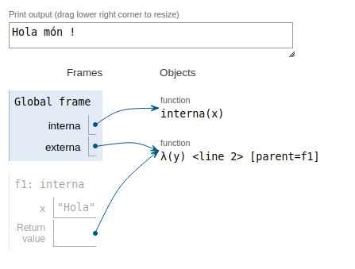

class: center, middle

## Conceptes Avançats de Programació

# Clausures

<br>

**Jordi Delgado i Gerard Escudero**

<br>

Departament de Ciències de la Computació

Universitat Politècnica de Catalunya

<br>

 

---
class: left, middle, inverse

## Sumari

- .cyan[Clausures]

- Exercicis

- Atoms

- Exercicis

---

# Clausures

`fn` crea clausures (*closure*):
- tanca l'abast (*scope*) lèxic del voltant i captura els seus valors.

.cols5050[
.col1[
```clojure
(defn interna [x]
  (fn [y] (println x y "!"))) 
  ; torna una clausura que conté x 
  ; i la funció anònima

(def externa (interna "Hola"))

(externa "món")  👉  Hola món !
```

Fixeu-vos en que si la funció interna tornés només una funció, no funcionaria.
]
.col2[


.small[diagrama: [Python Tutor](https://pythontutor.com)]
]]

---

# Python Tutor

Podeu veure com funciona pas a pas utilitzant l'eina:

[Python Tutor](https://pythontutor.com/visualize.html#mode=edit)

i inserint l'equivalent python de l'_script_ anterior:

```python
def interna(x):
    return lambda y: print(x, y, "!")
    
externa = interna("Hola")

externa("món")
```

i clicant a **Visualize Execution**.

---
class: left, middle, inverse

## Sumari

- .brown[Clausures]

- .cyan[Exercicis]

- Atoms

- Exercicis

---

# Exercicis

- Executa aquest codi i justifica el resultat que mostra.

    ```clojure
    (ns misteri)

    (defn misteri [n]
      (let [secret 4
            n (+ n 2)]
        (fn [mult]
          (* secret (* mult n)))))

    (defn misteri3 [param]
      (fn [bonus]
        (+ (param 6) bonus)))

    (let [h (misteri 3)
          j (misteri3 h)
          result (j 2)]
      (println result))
    ```

- [X56149 Clojure - Punts amb clausures 1](https://jutge.org/problems/X56149_ca)

- [T66007 Clojure - Partial amb clausures](https://jutge.org/problems/T66007_ca)

---
class: left, middle, inverse

## Sumari

- .brown[Clausures]

- .brown[Exercicis]

- .cyan[Atoms]

- Exercicis

---

# Atoms

Els atoms són objectes que contenen referències a valors. Ens permetran afegir mutabilitat a les clausures.

.cols5050[
.col1[
**Inicialització**:

```clojure
(atom 0)
```

```clojure
(def comptador (atom 0))      ; global

(let [comptador (atom 0)]     ; local
  ...)
```

**Accés**:

```clojure
(deref comptador)  👉  0

@comptador  👉  0
```
]
.col2[
**Modificació amb funció**:

```clojure
(swap! comptador #(+ % 1)) 👉 1

(swap! comptador inc)  👉  2
```

<br>

**Modificació amb valor**:

```clojure
(reset! comptador 3)  👉  3
```

]]


---
class: left, middle, inverse

## Sumari

- .brown[Clausures]

- .brown[Exercicis]

- .brown[Atoms]

- .cyan[Exercicis]

---

# Exercicis

- Estudieu aquest codi i justifiqueu perquè funciona:

.cols5050[
.col1[
```clojure
(defn memoize [f]
  (let [mem (atom {})]
    (fn [& args]
      (if-let [e (find @mem args)]
        (val e)
        (let [ret (apply f args)]
          (swap! mem assoc args ret)
          ret)))))

(defn fib [n]
  (if (<= n 1)
    n
    (+ (fib (dec n)) (fib (- n 2)))))
```
]
.col2[
```clojure
(time (fib 35))
user=> "Elapsed time: 941.445 msecs"

(def fib (memoize fib))

(time (fib 35))
user=> "Elapsed time: 0.044 msecs"
```
]]

- [X86942 Clojure - Punts amb clausures 2](https://jutge.org/problems/X86942_ca/statement)

.footnote[font: [Clojure - Atoms](https://clojure.org/reference/atoms)]

