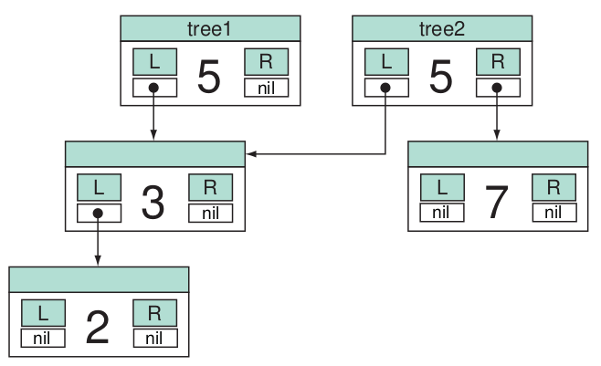

class: center, middle

## Conceptes Avançats de Programació

# Immutabilitat i estructures de dades

<br>

**Jordi Delgado i Gerard Escudero**

<br>

Departament de Ciències de la Computació

Universitat Politècnica de Catalunya

<br>

 

---
class: left, middle, inverse

## Sumari

- .cyan[Immutabilitat]

- Exercicis

---

# Immutabilitat

**Concepte**:

- Objecte **immutable**: una vegada creat, no es pot canviar el seu estat.

- Essencialment, **immutabilitat** vol dir que una vegada assignem una valor a una variable, aquest valor no es podrà canviar durant el curs de la seva existència.

**Exemple**:

- Per modificar una llista hem de crear-ne una de nova:

  ```clojure
  (defn inserir [ll val pos]
      (concat (take pos ll) (conj (drop pos ll) val)))

  (inserir '(1 2 4 5) 3 2)  👉  (1 2 3 4 5)
  ```

---

# Programació funcional

Una de les característiques de la programació funcional és la de la creació de **funcions pures** per crear codi més segur.

- S'intenta separar o aïllar la noció d'estat.

- L'estat és el responsable més gran dels efectes laterals.

- Una funció és **pura** quan sempre retorna el mateix resultat per una mateixa entrada, sense efectes laterals.

  - Són més fàcils de testejar, depurar i mantenir.

  - No modifiquen dades de fora el seu àmbit (*scope*).

---

# Immutabilitat i programació funcional

La immutabilitat sempre a estat preferent en el món de la programació funcional, ajudant a la definició de funcions pures.

- Ajuda a fer més codi més predecible;
  - evitant canvis de dades impredictibles, i
  - permetent el raonament sobre el codi.

- Ajuda en la compartició de dades.

.center[]

- Programació concurrent i paral·lela:

  - Accés i manipulació d'estructures de dades compartides

---

# Consideracions finals

**Reptes**:

- La creació de noves estructures de dades pot dur a **problemes d'espai**. Els llenguatges funcionals moderns estan treballant en tècniques per minimitzar l'impacte mitjançant optimització o comparició de dades.

- En aplicacions intensives, la creació de noves instàncies pot arribar a ser un problema seriós. Tècniques com l'avaluació mandrosa, cachés o memoizatció poden ajudar a minimitzar aquest impacte.

**Conclusions**:

- Tot i aquests reptes, l'ús de l'immutabilitat i la programació funcional continua sent un dels fronts actius de les pràctiques de programació moderna.

- Un dels àmbits més actius està en la programació concurrent i paral·lela.

---
class: left, middle, inverse

## Sumari

- .brown[Immutabilitat]

- .cyan[Exercicis]

---

# Exercicis

1. [Arbre binari](problemes/nombres.pdf)

2. Expressions
