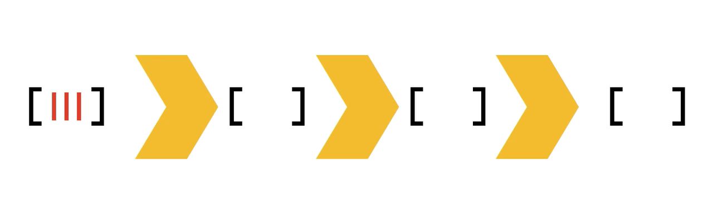
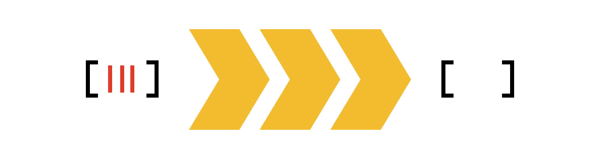

class: center, middle

## Conceptes Avançats de Programació

# Tècniques amb funcions d'ordre superior

<br>

**Jordi Delgado i Gerard Escudero**

<br>

Departament de Ciències de la Computació

Universitat Politècnica de Catalunya

<br>

 

---
class: left, middle, inverse

## Sumari

- .cyan[Divideix i venç]

- *Backtracking*

- *Continuation-Passing Style*

- *Trampolining*

- *Transducers*

---

# Divideix i venç

Definir funcions: 
- `trivial`: predicat cas trivial
- `directe`: resultat cas trivial
- `dividir`: retorna dos subproblemes
- `vèncer`: composició dels subproblemes

Funció `dIv`:

```clojure
(defn dIv
  [trivial directe dividir vèncer]
  (letfn [(dIv' [vct]
            (if (trivial vct)
              (directe vct)
              (let [[x1 x2] (dividir vct)
                    y1 (dIv' x1)
                    y2 (dIv' x2)]
                (vèncer vct [x1,x2] [y1,y2]))))]
    dIv'))
```

#### Exercici

- [Y73217 Clojure - Cerca dicotòmica amb Divideix i venç](https://jutge.org/problems/Y73217_ca)

---
class: left, middle, inverse

## Sumari

- .brown[Divideix i venç]

- .cyan[*Backtracking*]

- *Continuation-Passing Style*

- *Trampolining*

- *Transducers*

---

# Backtracking

Definir funcions: 
- `initial`: solució parcial buida
- `obj`: objectiu assolit?
- `succ`: següent solució parcial

Funció `bTck`:

```clojure
(defn bTck [succ obj]
  (letfn [(bTck' [v]
            (cond
              (empty? v)     []
              (obj (peek v)) (conj (bTck' (pop v)) (peek v))
              :else          (let [x (peek v)]
                               (recur (foldr (flip conj) (pop v) (succ x))))))]
    (fn [inicial]
      (bTck' [inicial]))))
```

#### Exercici

- [Clojure - Parèntesis amb Backtracking](https://jutge.org/problems/S28790_ca)


---
class: left, middle, inverse

## Sumari

- .brown[Divideix i venç]

- .brown[*Backtracking*]

- .cyan[*Continuation-Passing Style*]

- *Trampolining*

- *Transducers*

---

# *Continuation-Passing Style*

És una tècnica de la programació funcional en la que es retornen les funcions a aplicar al resultat, en lloc dels valors.

**Exemple**:

```clojure
(def expr #(+ (* (+ 1 2) 3) 4))
(expr)  👉  13
```

Fem una funció per cada operació.

```clojure
(def mes2 (fn [x cont] (cont (+ 2 x))))
(def per3 (fn [x cont] (cont (* 3 x))))
(def mes4 (fn [x cont] (cont (+ 4 x))))

(defn expr_cps [x cont]
  (mes2 x 
    (fn [y]
      (per3 y 
        (fn [z] 
          (mes4 z 
            (fn [res]
              (cont res))))))))

(expr_cps 1 println)  👉  13
```

---

# CPS amb funcions recursives

Amb una funció recursiva és més natural.

**Exemple**:

```clojure
(defn fact_cps [n cont]
  (if (== n 0)
    (cont 1)
    (fact_cps (dec n) #(cont (*' n %))))) 

(fact_cps 6 identity)  👉  720
```

Continuem tenint el problema de la pila.

#### Exercici

- [W83860 Clojure - my-map en Continuation-Passing Style](https://jutge.org/problems/W83860_ca)

---
class: left, middle, inverse

## Sumari

- .brown[Divideix i venç]

- .brown[*Backtracking*]

- .brown[*Continuation-Passing Style*]

- .cyan[*Trampolining*]

- *Transducers*

---

# *Trampolining*

`(trampoline f & args)`

Aplica `f` a `args` i continua aplicant el resultat fins que deixa de ser una funció. És una tècnica que evita el creixement de la pila.

**Factorial**: Afegim a la funció factorial un parell de *lambdes*:

.cols5050[
.col1[
```clojure
(defn fact_cps2 [n cont]
  (if (== n 0)
    (cont 1)
    (fn [] 
      (fact_cps2 
        (dec n)
        (fn [valor] 
          (fn [] 
            (cont (*' n valor))))))))
```
]
.col2[

**Funciona!**

```python
(trampoline fact_cps2 6 identity)  
👉  720
```

```python
(trampoline fact_cps2 1000 identity)
👉  4023872600770.....0000000000000000N
```
]]

#### Exercici

- [W83860 Clojure - my-map en Continuation-Passing Style](https://jutge.org/problems/W83860_ca)

---
class: left, middle, inverse

## Sumari

- .brown[*Tail Recursion*]

- .brown[*Continuation-Passing Style*]

- .brown[*Trampolining*]

- .cyan[*Transducers*]

---

# Transducers

Els *transducers* són cadenes de processament de dades que:
- funcionen mitjançant composició
- optimitzen el procés per eficiència

.cols5050[
.col1[
```clojure
(->> (range 10) 
    (map inc) 
    (filter even?) 
    (reduce +))

👉  30
```



]
.col2[
```clojure
(transduce 
    (comp 
        (map inc) 
        (filter even?)) 
    + 
    (range 10))

👉  30
```

<br>
]]


La funció .blue[*tranduce*] implica un .blue[*reduce*] final.

[font: Transducers](https://fasihkhatib.com/2018/01/06/transducers/)

---

# Transducers

.blue[eduction]: quan no volem el *reduce* final.

```clojure
(eduction (comp (map inc) (filter even?)) (range 10))
(2 4 6 8 10)

👉  (2 4 6 8 10)
```

.blue[into]: crida internament a *transduce*.

```clojure
(into [] (comp (map inc) (filter even?)) (range 10))

👉  [2 4 6 8 10]
```

.blue[sequence]: per avaluació *lazy*.

```clojure
(sequence (comp (map inc) (filter even?)) (range 10))

👉  (2 4 6 8 10)
```

#### Exercici

- [Z78471 Clojure - Transducers](https://jutge.org/problems/Z78471_ca)

